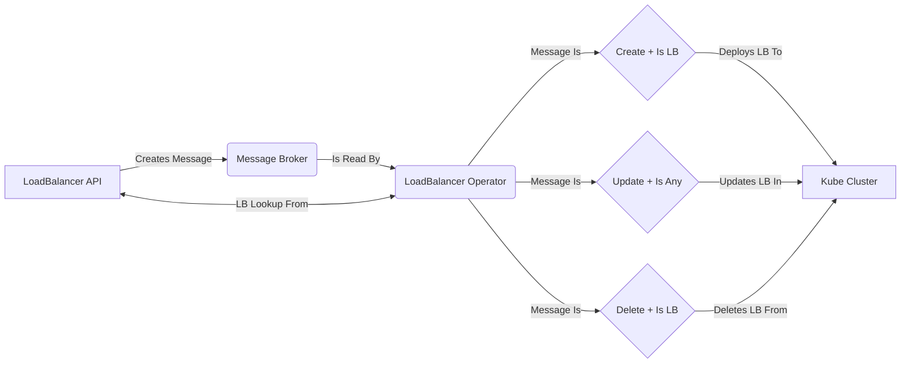

# loadbalanceroperator 

**Note:** loadbalanceroperator is currently under active (and early) development and is likely to change quite frequently.

## Purpose

The purpose of the load-balancer-operator is to manage the load balancer lifecycle based upon requests that are sent to the Load Balancer API. By subscribing to the various events that are created by the API, the operator can then take the appropriate CUD action on a load balancer and ensure that is deployed to a specified Kubernetes cluster.

## Workflow

## Development

We recommend using the supported `devcontainer` provided in this repository, other local setups are not supported (and your milage may vary). It is already configured with all of the appropriate toolings.  The provided development environment will spin up the additional tooling you required including:
- nats configured with necessary queues
- preconfigured required environment variables
- necessary haproxy chart
- kind kubernetes cluster
